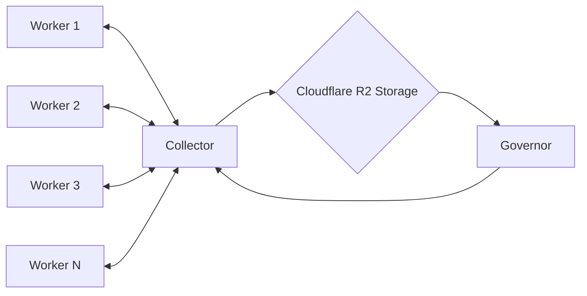

# Binary Beavers

Beavers break down logs: distributed discrete logarithm solver for finite fields.  

```bash
# Prime modulus
p = 3217014639198601771090467299986349868436393574029172456674199

# Generator
g = 5

# Precomputed powers of the generator (5) modulo p
5^a = 244241057144443665472449725715508406620552440771362355600491
5^b = 794175985233932171488379184551301257494458499937502344155004
```

# Design Considerations

- **Optimization and Efficiency**: Emphasize improving the efficiency of factorization and other intensive computational tasks to enhance system performance.
- **Scalability**: Design the system for easy scaling, both in terms of increasing resource capability (vertical scaling) and adding more instances (horizontal scaling).
- **Validation and Testing**: Perform extensive testing on all system components to ensure functionality and performance are as expected under various conditions.
- **Error Handling and Logging**: Implement comprehensive error handling and logging to facilitate troubleshooting and system monitoring.

# Architecture



## Worker

**Workers** are tasked with generating and factoring relations. They are designed to be lightweight, deployable across diverse environments, and continuously operate until the **Collector** signals completion of the task.

1. **Set Parameters**:
    - Assign `g`, `p`, and `g^a` for the current task
2. **Initialize Factor Base**:
    - Calculate the smoothness bound using heuristic:
    
    $$
    B = \exp\left(\left(\frac{64}{9}\cdot \log(p)\right)^{\frac{1}{3}} \cdot \left(\log(\log(p))\right)^{\frac{2}{3}}\right)
    
    $$
    
    - For `p` as above, `B = 3569817792505`
    - Create the factor base using primes up to this bound
3. **Generator Loop**:
    - Continuously execute the following steps within the loop until a successful factorization is emitted (signaled by collector):
        - **Generate Relations Using a Quadratic Sieve**: Select `h` and `k` such that $(g^k + h)(g^k - h)$ is likely smooth
        - **Attempt Factorization**: Attempt to factor $g^{2k) - h^2$, $(g^k + h)$, and $(g^k-h)$ using the primes in the factor base; if not smooth, discard the attempt and generate a new relation
        - **Emit Successful Factorizations**: When $g^{2k} - h^2$ successfully factors smoothly, emit the details of the relation and its factorization and check for task completion
            - **`202 Accepted`** to continue
            - **`418 I'm a Teapot`** for task complete

## Collector

The **Collector** serves as the central aggregation point for factorizations from workers, storing them in Cloudflare R2 Storage. Crucially, it also acts as a signal controller, directing workers to halt or continue based on the analysis of stored data and the overall progress towards solving the discrete logarithm problem.

- **handleRequest**: This function processes incoming requests. It checks if the task is complete and processes the relation data accordingly.
- **taskIsComplete**: A placeholder function that should contain logic to check if the overall task is complete. This might involve checking a flag in Cloudflare R2 storage or another persistent store.
- **storeRelation**: This function should handle the storage of the relation data. You might need to configure Cloudflare R2 bindings and access permissions for this to work.

## Governor

The **Governor** regularly reviews stored factorizations, evaluating whether enough relations have been gathered to move forward with the linear algebra phase essential for resolving the discrete logarithm.